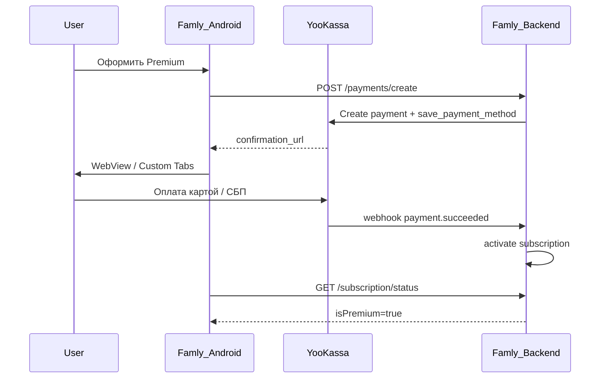

# ЮKassa — интеграция подписок (v2, Play Market)

Долгосрочная перспектива: пользователи устанавливают из Google Play, оплачивают Premium через ЮKassa (вне Play Billing).

## Почему ЮKassa, а не Play Billing

Google Play Billing недоступен для цифровых покупок пользователям из РФ с марта 2022. Play — канал дистрибуции, оплата — через ЮKassa.

## Архитектура



## Шаги интеграции

### 1. Регистрация

- [ ] Магазин в [YooKassa](https://yookassa.ru/)
- [ ] Shop ID + Secret Key
- [ ] Webhook URL: `https://api.famly.app/webhooks/yookassa`

### 2. Recurring payments

ЮKassa поддерживает сохранение платёжного метода для автоплатежей:

```json
{
  "amount": { "value": "199.00", "currency": "RUB" },
  "capture": true,
  "save_payment_method": true,
  "confirmation": {
    "type": "redirect",
    "return_url": "famly://payment/success"
  },
  "description": "Famly Premium — 1 месяц",
  "metadata": { "user_id": "uuid", "plan": "monthly" }
}
```

Годовой план: `1500.00 RUB`, metadata `plan: yearly`

### 3. Backend endpoint (добавить)

```
POST /payments/create
Authorization: Bearer JWT
Body: { "plan": "monthly" | "yearly" }
Response: { "paymentUrl": "https://..." }
```

Webhook уже реализован: `POST /webhooks/yookassa` в `backend/plugins/Routing.kt`

### 4. Android

```kotlin
// PaymentActivity.kt — Custom Tabs с payment URL
// Deep link famly://payment/success → проверка статуса подписки
// BillingRepository.checkSubscription() → GET /subscription/status
```

### 5. Play Market listing

- Указать в описании: «Оплата Premium через сайт/приложение (ЮKassa)»
- Не использовать Play Billing для RU
- Ссылка на политику конфиденциальности обязательна

## Цены

| Plan | Product | Цена |
|------|---------|------|
| monthly | famly_premium_monthly | 199 ₽ |
| yearly | famly_premium_yearly | 1500 ₽ |

## Безопасность

- Secret Key только на backend
- Webhook: verify IP / signature (настроить в YooKassa)
- HTTPS обязателен

## Тестирование

- YooKassa sandbox + тестовые карты
- Проверить webhook delivery
- Проверить restore после переустановки (JWT + /subscription/status)
